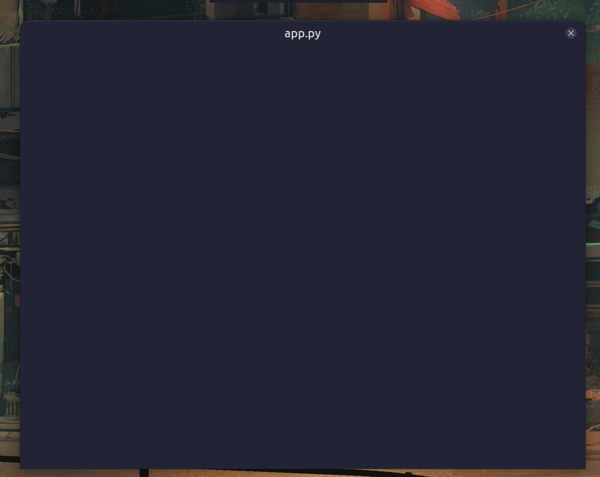

# pyside6  
This is a guide by Railerival, based on pyside6 docs, Fahoomp's help thread on pyside6 in [python discord server](https://discord.gg/python) and some other internet resources... 

**pyside6** is a **G**raphical **u**ser **i**nterface(GUI) framework for python.

### Requirements for pyside6
- python 3.10+ 
- using a virtual environment is highly recommended
### How to install
`pip install pyside6`  
`uv add pyside6`  
u can check the installation and version by running these:
```py
import PySide6.QtCore

# Prints PySide6 version
print(PySide6.__version__)

# Prints the Qt version used to compile PySide6
print(PySide6.QtCore.__version__)
```
### Intro
* Definition of Gui from wikipedia:
> A graphical user interface, or GUI,[a] is a form of user interface that allows users to interact with electronic devices through graphical icons and visual indicators such as secondary notation.

Its basically a user interface for users to interact with.. 
   
* GUI has majorly two components :  An application and something to display ...    
* The gui is basically a while loop, it's constantly listening for "events", things like mouse actions (clicks or movement),   interacting with widgets, moving the window, etc  
* This is a basic pyside app : 
```py
from PySide6 import QtWidgets, QtGui, QtCore
from PySide6.QtCore import Qt


app = QtWidgets.QApplication()
win = QtWidgets.QDialog()
win.show() 
app.exec() #this starts the main loop
#if the last line is not added the windows just opens and closes
```

* Steps in making an app
> create app instance    
> create instance of thing we want to   show   
> show widget  
> start app  
* we inherit from the widgets and make our custom class for the thing we want to display..


